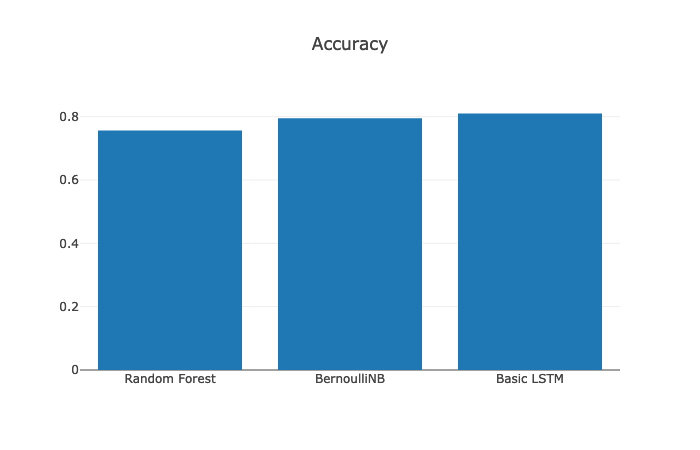
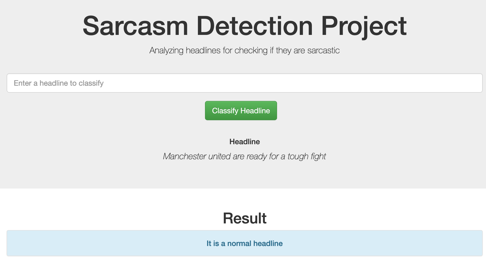
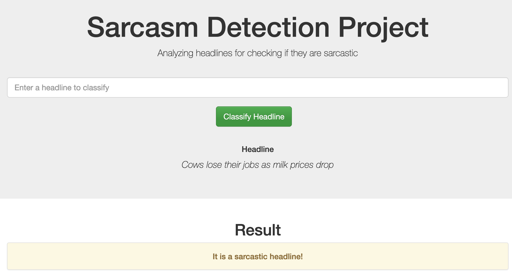

# Sarcasm Detection
It is aimed at detecting sarcasm in news headlines.
I have also developed a web app where user can type some news headline or some text and check whether it is sarcastic or not.

### Table of Contents

1. [Setting up your enviroment](#installation)
2. [Project Motivation](#motivation)
3. [File Descriptions](#files)
4. [Instructions](#instructions)
5. [Results](#results)
6. [Conclusion](#conc)
7. [Licensing, Authors, and Acknowledgements](#ack)


## Setting up your enviroment <a name="installation"></a>
Python 3.* is required to run this Project. If you are running Anaconda, then you'll need four extra libraries (4 to 5):
1. Pandas
2. Numpy
3. Matplotlib
4. Plotly
5. Wordcloud
6. NLTK
7. Keras

Install above dependencies using ```pip install <dependency>```


## Project Motivation<a name="motivation"></a>

Recent advances in natural language sentence generation research have seen increasing interests in measuring negativity and positivity from thesentiment of words or phrases. However, accuracy and robustness of results are often affected by untruthful sentiments that are sarcastic in nature and this is often left untreated. Sarcasm detection is a very important process which can help to filter out noisy data (i,.e sarcastic sentences) from training data inputs, which can be used for natural language sentence generation<sup>[2](https://www.kaggle.com/rmisra/news-headlines-dataset-for-sarcasm-detection)</sup>.
#### Project Overview and analysis can be found in the notebook


## File Descriptions <a name="files"></a>

All my work is in the notebook. Data folder contains two files, both of which are required by the notebook

## Instructions <a name="instructions"></a>
To run the web app:
1. Go to app directory ```cd app```
2. Run the run.py file ```python run.py```
3. Open your browser and go to http://localhost:3001
4. Test normal headlines from here: https://www.sciencedaily.com/news/computers_math/artificial_intelligence/
5. Test sarcastic headlines from here: https://bestlifeonline.com/funniest-newspaper-headlines-of-all-time/


## Note: 
Since I'm using plotly which use iframes for visualizations, you won't be able to see them in notebook on github. Please download and open the HTML file in Firefox/Chrome.

## Results<a name="results"></a>
I'm using accuracy to compare the models


1. Testing a normal headline outside of dataset:


2. Testing a sarcastic headline: outside of dataset:



## Conclusion<a name="conc"></a>
- I tried three different models but still not able to breach 90% mark. Deep Learning method seems promising, but we are short of data to use more advanced deep learning models. Even a basic LSTM seemed to be overfitting in just 10 epochs. So, one thing which would be good to have would be more data
- From amongst traditional machine learning methods, Naive Bayes works better than Random Forest in my case. Naive Bayes is a good algorithm for working with text classification. When dealing with text, it’s very common to treat each unique word as a feature, and since the typical person’s vocabulary is many thousands of words, this makes for a large number of features. The relative simplicity of the algorithm and the independent features assumption of Naive Bayes make it a strong performer for classifying texts.
- For the webapp, I'm going with Naive Bayes for the following reasons:
    - It requires less model training time
    - Naive Bayes model size is low and quite constant with respect to the data
    - Naive Bayes can quickly adapt to changes in data whereas we would have to rebuild Random Forest everytime


## Acknowledgements<a name="ack"></a>
1. https://www.kaggle.com/rmisra/news-headlines-dataset-for-sarcasm-detection
2. http://cs229.stanford.edu/proj2015/044_report.pdf
3. https://medium.com/dair-ai/detecting-sarcasm-with-deep-convolutional-neural-networks-4a0657f79e80
